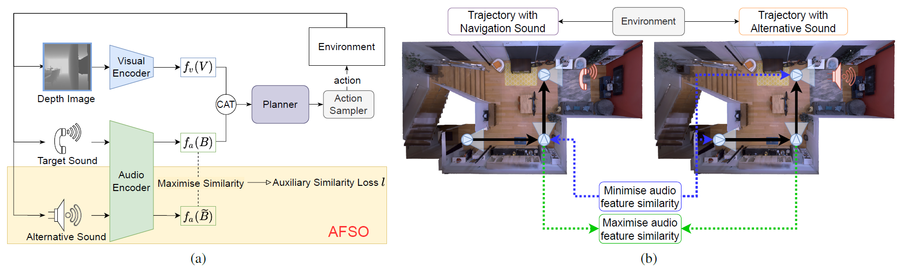

# AV-GeN: Generalisable Audio Visual Navigation



Repository for ["Towards Generalisable Audio Representations for Audio-Visual Navigation"](https://arxiv.org/abs/2206.00393) in CVPR Embodied AI Workshop 2022.


## Installation
1. Install SoundSpaces from [this commit](https://github.com/facebookresearch/sound-spaces/tree/0e87180459a5c9901bd1b17fe83405ebe57b9360)
. Be sure to also install its dependencies and download the datasets following the instructions in the SoundSpaces repository.
2. Clone files from this repository and pastes them into your SoundSpaces directory.

## Usage
This repo provides the code for the AV-NAV + AFSO and the AV-WaN + AFSO methods as described in the paper. The code for the two methods is included in `ss_baselines/av_exp` and `ss_baselines/av_wan` respectively. 

Below we show some example commands for training and evaluating a (WaN + AFSO) agent with a depth sensor on Matterport3D.

1. Training
```
python ss_baselines/av_wan/run.py --run-type train --exp-config ss_baselines/av_wan/config/audionav/mp3d/train_with_ssloss.yaml --model-dir data/models/mp3d/test
```
2. Validate checkpoints and generate a validation curve.
```
python ss_baselines/av_wan/run.py --run-type eval --exp-config ss_baselines/av_wan/config/audionav/mp3d/test_with_am.yaml --model-dir data/models/mp3d/test
```
3. Test the best validation checkpoint based on the validation curve. A pretrained model is provided in the repo.
```
python ss_baselines/av_wan/run.py --run-type eval --exp-config ss_baselines/av_wan/config/audionav/mp3d/test_with_am.yaml --model-dir data/models/mp3d/test EVAL_CKPT_PATH_DIR data/models/mp3d/test/data/ckpt.best.pth EVAL.SPLIT test_multiple_unheard
```
## Citation  
```
@InProceedings{Mao_2022_EAI,
    author    = {Mao, Shunqi and Zhang, Chaoyi and Wang, Heng and Cai, Weidong},
    title     = {Towards Generalisable Audio Representations for Audio-Visual Navigation},
    booktitle = {2022 IEEE/CVF Conference on Computer Vision and Pattern Recognition, Embodied AI Workshop (EAI)},
    month     = {June},
    year      = {2022}
}
```
## Acknowledgement
The code is developed based on [SoundSpaces](https://github.com/facebookresearch/sound-spaces).